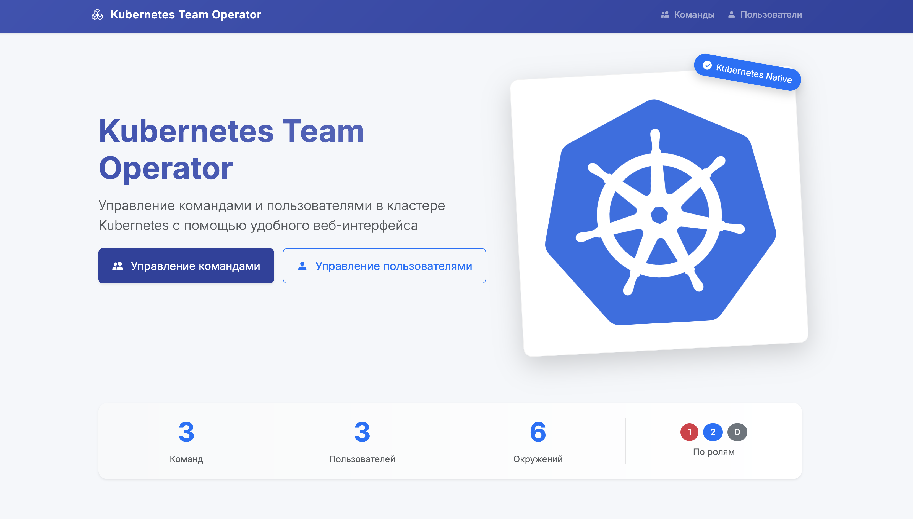

# Kubernetes оператор для управления командами и пользователями



## Описание проекта

Этот проект представляет собой Kubernetes оператор, который позволяет управлять командами и пользователями в кластере Kubernetes через пользовательские ресурсы (Custom Resources). Проект состоит из двух основных компонентов:

1. **Kubernetes оператор** - отслеживает изменения в пользовательских ресурсах и применяет соответствующие изменения в кластере.
2. **Веб-интерфейс** - предоставляет интерфейс для управления командами и пользователями.

## Функциональность

### Управление командами
- Создание, просмотр, редактирование и удаление команд
- Назначение ресурсов для команд
- Управление доступом команд к ресурсам кластера

### Управление пользователями
- Создание, просмотр, редактирование и удаление пользователей
- Назначение пользователей в команды
- Генерация kubeconfig для пользователей

## Требования

- Kubernetes кластер (версия 1.16+)
- Python 3.8+
- Доступ к кластеру с правами администратора

## Установка и запуск

### Локальный запуск

1. Клонируйте репозиторий
```bash
git clone <url-репозитория>
cd <имя-директории>
```

2. Сконфигурируйте доступ к Kubernetes кластеру. Оператор и UI берут доступ к кубу из стандартного kubeconfig.

3. Примените CRD (Custom Resource Definitions)
```bash
kubectl apply -f crd.yaml
```

4. Установите зависимости
```bash
pip install -r requirements.txt
```

5. Запустите оператор
```bash
python operator.py
```

6. В отдельном терминале запустите веб-интерфейс
```bash
python app.py
```

7. Откройте веб-интерфейс в браузере по адресу http://localhost:8080

## Примеры использования

### Создание команды

Пример манифеста для создания команды:
```yaml
apiVersion: team.example.com/v1
kind: Team
metadata:
  name: team-example
spec:
  environments:
    - name: dev
      description: "Среда разработки"
      quota:
        cpu: "2"
        memory: "4Gi"
        pods: "20"
    - name: test
      description: "Тестовая среда"
      quota:
        cpu: "1"
        memory: "2Gi"
        pods: "10"
```

### Создание пользователя

Пример манифеста для создания пользователя:
```yaml
apiVersion: team.example.com/v1
kind: User
metadata:
  name: user-example
spec:
  fullName: "Иван Иванов"
  email: "ivan@example.com"
  teams: ["team-example"]
  role: "developer"
```

## Структура проекта

- `app.py` - веб-интерфейс на Flask
- `operator.py` - Kubernetes оператор на kopf
- `crd.yaml` - определения пользовательских ресурсов
- `templates/` - шаблоны для веб-интерфейса
- `examples/` - примеры ресурсов

## Лицензия

MIT

## Авторы


